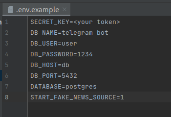
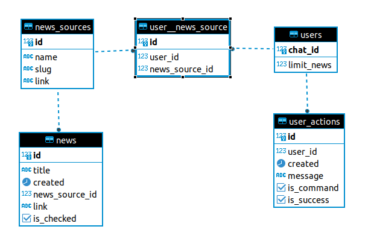

# telegram-bot-news

Тестовое задание Telegram bot

## Инструкция запуска:

* Переименовать файл .env.example в .env.dev
* Вставить в SECRET_KEY ваш telegram token
* Запустить команду ```docker-compose up -d```

.env




Для упрощения тестирования функционала создан дополнительный класс FakeParser.
В случае если переменная окружения START_FAKE_NEWS_SOURCE = 1, 
в базу при запуске записываются подготовленные новости, 
а также каждую минуту будет добавляться фейковая новостная запись


## Команды

```/from_source[_title]```

Получить n новостей из источника **title**. Если **title** не указан - вывод всех источников

```/update_n n```

Изменить количество новостей n, которые выгружаются за один раз командой ```/from_source```

```/follow_source[_title]```

Подписаться на уведомления о новых новостях источника **title**. Если **title** не указан - 
список всех источников

```/unfollow_source[_title]```

Отписаться от уведомлений о новых новостях источника **title**. Если **title** не указан - 
список всех источников  

## Схема базы данных





